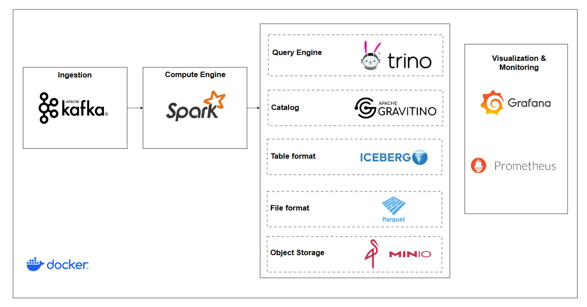

#  Modern Data Lakehouse with Apache Iceberg

A production-grade, containerized Data Lakehouse environment featuring Apache Iceberg, Spark Cluster, Kafka, Trino, and Gravitino REST Catalog. Built with modern data engineering best practices and optimized for local development and testing.

## 📐 Architecture



The architecture follows a layered approach:
- **Ingestion Layer**: Apache Kafka for real-time data streaming
- **Compute Layer**: Apache Spark cluster (1 Master + 2 Workers) for distributed processing
- **Query Layer**: Trino for fast, interactive SQL analytics
- **Catalog Layer**: Apache Gravitino as the Iceberg REST catalog service
- **Table Format**: Apache Iceberg for ACID transactions and time travel
- **File Format**: Apache Parquet for efficient columnar storage
- **Storage Layer**: MinIO (S3-compatible) for scalable object storage
- **Observability**: Grafana and Prometheus for metrics and monitoring

## ✨ Key Features

- **🔄 ACID Transactions**: Full ACID support via Apache Iceberg with snapshot isolation
- **⚡ Distributed Processing**: Spark cluster with 1 master and 2 worker nodes
- **🎯 Multi-Engine Access**: Query data using Spark SQL, Trino, or PySpark notebooks
- **📊 Real-time Ingestion**: Kafka cluster (3-node KRaft) for streaming data pipelines
- **🔍 Unified Catalog**: Gravitino REST catalog for centralized metadata management
- **📈 Built-in Monitoring**: Prometheus metrics with Grafana dashboards
- **🐳 Fully Dockerized**: One-command deployment with Docker Compose
- **🔐 S3-Compatible Storage**: MinIO for cost-effective data lake storage

## 🛠 Technology Stack

| Component | Version | Purpose |
|-----------|---------|---------|
| **Apache Spark** | 3.5.5 | Distributed data processing engine |
| **Apache Iceberg** | 1.10.0 | Open table format for huge analytic datasets |
| **Apache Gravitino** | 1.1.0 | REST catalog service for lakehouse metadata |
| **Apache Kafka** | 3.9.0 | Distributed event streaming platform |
| **Trino** | 471 | Fast distributed SQL query engine |
| **MinIO** | 2025-09-07 | S3-compatible object storage |
| **PostgreSQL** | 16 | Catalog backend database |
| **Grafana** | 12.1.0 | Metrics visualization |
| **Prometheus** | 3.5.1 | Metrics collection and alerting |
| **Python** | 3.12.3 | Runtime for PySpark applications |
| **Java** | 17 | Runtime for JVM-based services |

## 🚀 Quick Start

### Prerequisites
- Docker Engine 20.10+ with Docker Compose
- At least 8GB RAM available for containers
- Ports available: 8080, 8090, 8888, 9091, 3000, 9000, 5432

### 1. Clone and Start

```bash
# Clone the repository
git clone https://github.com/dducsw/mp252.git
cd mp252

# Start all services
docker compose up --detach --build
```

2. **Initialize Schema**:
   ```shell
   docker exec -it spark-master spark-sql -f /opt/spark/apps/setup/create_schema.sql
   ```

3. **Run a Pipeline**:
   ```shell
   docker exec -it spark-master python /opt/spark/apps/pipelines/create_example_table.py
   ```

4. **Using Notebooks**:
   - Access **JupyterLab** at `http://localhost:8888`.
   - Your notebooks are saved in the `notebooks/` directory.
   - To start a PySpark session in a notebook:
     ```python
     from pyspark.sql import SparkSession
     spark = SparkSession.builder.getOrCreate()
     ```

## 🔍 Querying Data
You can query tables using either Spark or Trino:

**Spark SQL:**
```shell
docker exec -it spark-master spark-sql
SELECT * FROM catalog_iceberg.schema_iceberg.table_iceberg;
```

**Trino CLI:**
```shell
docker exec -it trino trino --catalog catalog_iceberg --schema schema_iceberg
SELECT * FROM table_iceberg;
```

## 📁 Project Structure

```
Project
│
├── 📄 docker-compose.yml              # Main orchestration file for all services
├── 📄 .env                            # Environment variables and version configurations
├── 📄 README.md                       # Project documentation
├── 📄 .gitignore                      # Git ignore patterns
│
├── 📁 assets/                         # Documentation assets
│
├── 📁 infrastructure/                 # Service-specific configurations
│   │
│   ├── 📁 common/                     # Shared initialization scripts
│   │
│   ├── 📁 gravitino/                  # Apache Gravitino REST Catalog
│   │
│   ├── 📁 spark/                      # Apache Spark Cluster
│   │
│   ├── 📁 trino/                      # Trino Query Engine
│   │
│   ├── 📁 kafka/                      # Apache Kafka 
│   │
│   ├── 📁 minio/                      # MinIO S3-Compatible Storage
│   │
│   ├── 📁 postgres/                   # PostgreSQL Metadata Store
│   │
│   ├── 📁 grafana/                    # Grafana Monitoring
│   │
│   └── 📁 prometheus/                 # Prometheus Metrics Collection
│
├── 📁 notebooks/                      # Jupyter Notebooks
│   └── (Your interactive PySpark notebooks)
│
├── 📁 pipelines/                      # Data Processing Pipelines
│   └── create_example_table.py        # Sample Iceberg table creation
│
├── 📁 scripts/                        # Utility Scripts
│
└── 📁 setup/                          # Initial Setup Scripts
    └── create_schema.sql              # Database schema initialization
```


**⭐ Star this repository if you find it helpful!**

*Enhanced and maintained by [dducsw](https://github.com/dducsw). Based on the original project by [marcellinus-witarsah](https://github.com/marcellinus-witarsah/local-data-lakehouse-iceberg).*


